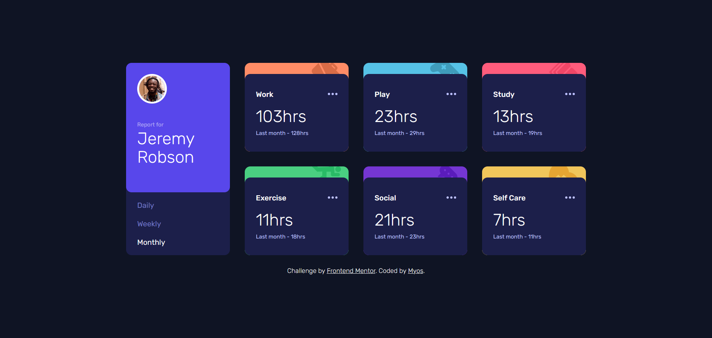
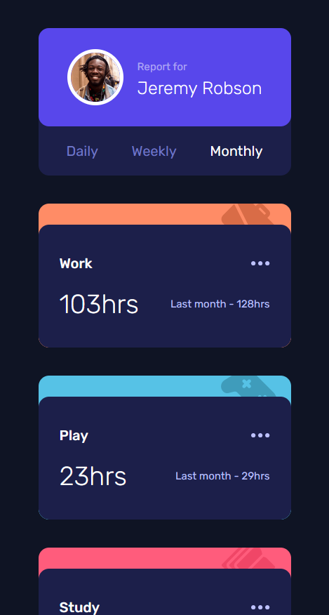
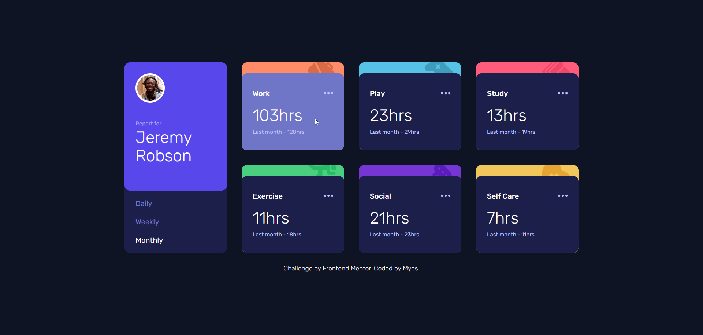

# Frontend Mentor - Time tracking dashboard solution

This is a solution to the [Time tracking dashboard challenge on Frontend Mentor](https://www.frontendmentor.io/challenges/time-tracking-dashboard-UIQ7167Jw). Frontend Mentor challenges help you improve your coding skills by building realistic projects.

## Table of contents

- [Frontend Mentor - Time tracking dashboard solution](#frontend-mentor---time-tracking-dashboard-solution)
  - [Table of contents](#table-of-contents)
  - [Overview](#overview)
    - [The challenge](#the-challenge)
    - [Screenshot](#screenshot)
    - [Links](#links)
  - [My process](#my-process)
    - [Built with](#built-with)
    - [Useful resources](#useful-resources)
  - [Author](#author)

**Note: Delete this note and update the table of contents based on what sections you keep.**

## Overview

### The challenge

Users should be able to:

- View the optimal layout for the site depending on their device's screen size
- See hover states for all interactive elements on the page
- Switch between viewing Daily, Weekly, and Monthly stats

### Screenshot

|                Desktop                |                Mobile                |                Active                |
| :-----------------------------------: | :----------------------------------: | :----------------------------------: |
|  |  |  |

### Links

- Solution URL: [https://github.com/Myoschen/time-tracking-dashboard](https://github.com/Myoschen/time-tracking-dashboard)
- Live Site URL: 

## My process

### Built with

- [React](https://reactjs.org/)
- [Vite](https://vitejs.dev/)
- [Tailwind CSS](https://tailwindcss.com/)
- [Class Variance Authority](https://cva.style/docs)
- [Fontsource](https://fontsource.org/)

### Useful resources

- [Example resource 1](https://www.example.com)

## Author

- Website - [Myoschen](https://github.com/Myoschen)
- Frontend Mentor - [@myoschen](https://www.frontendmentor.io/profile/myoschen)
